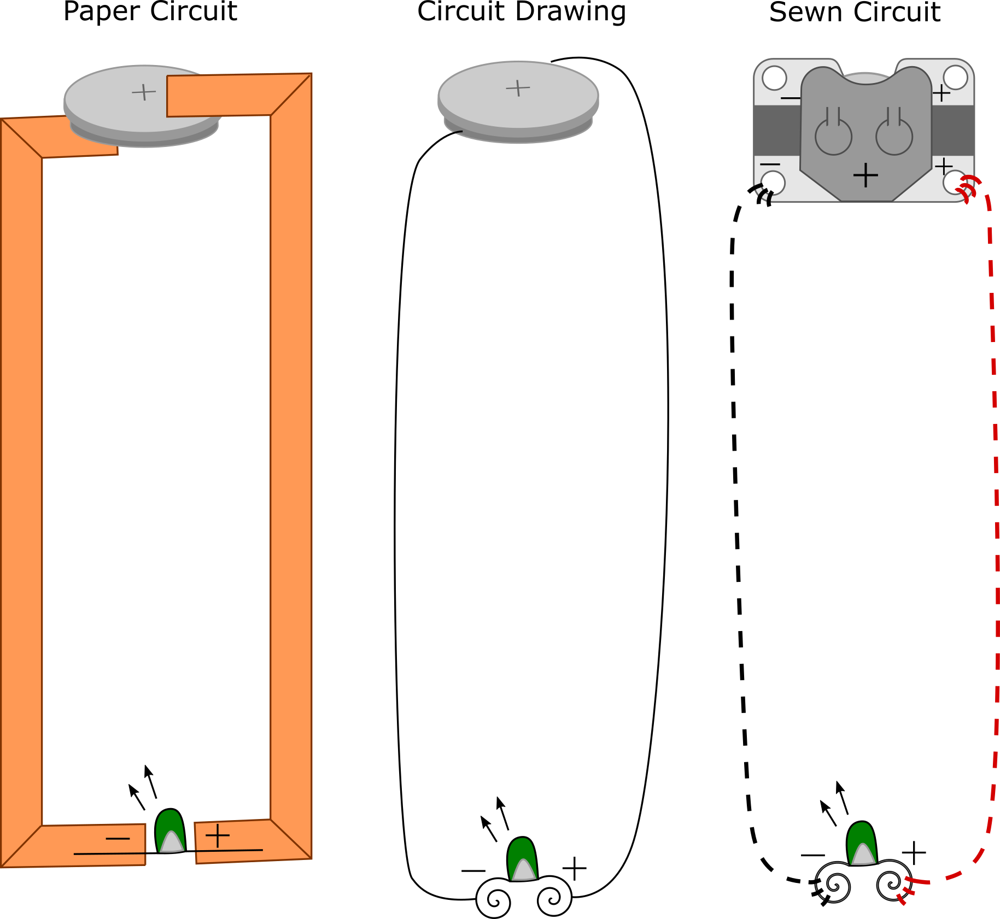
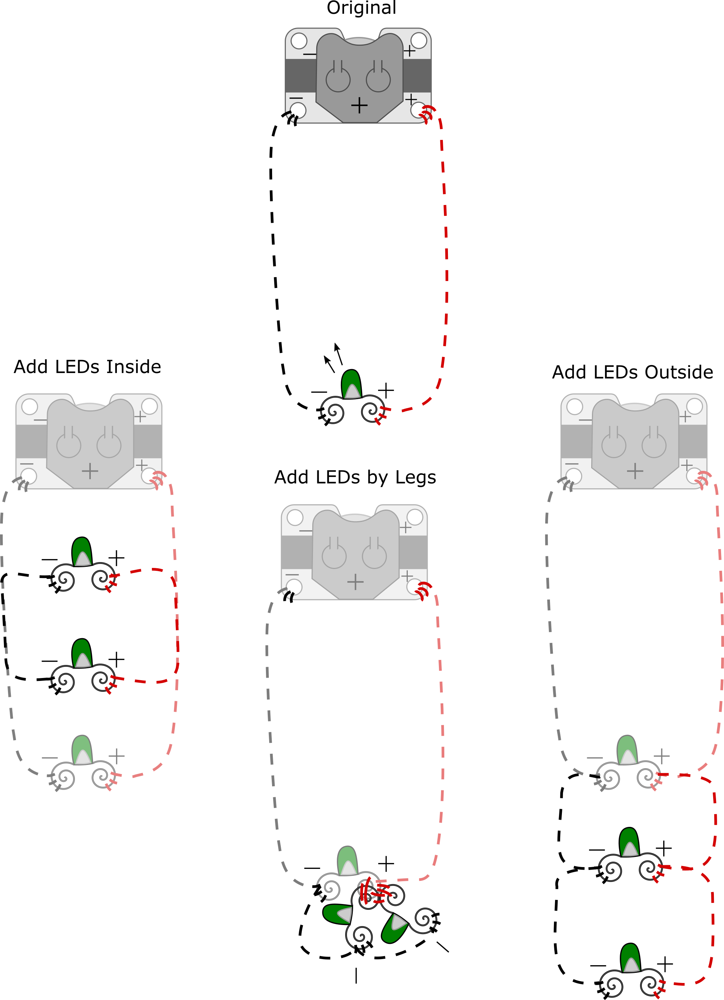
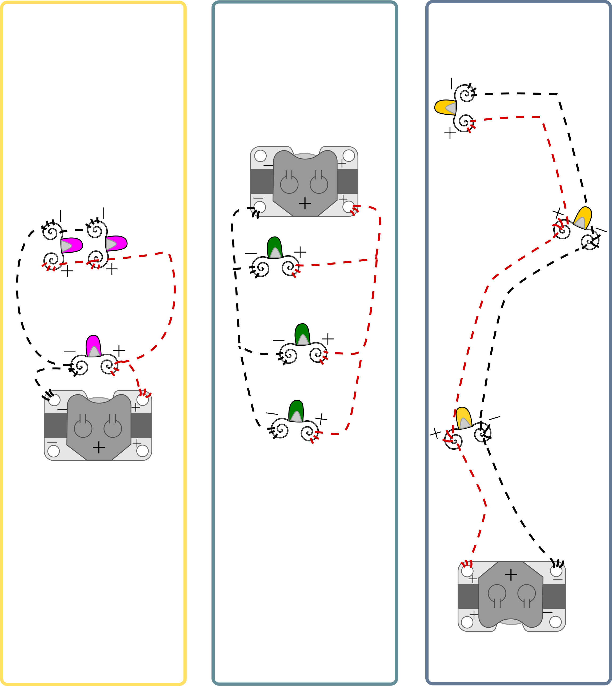
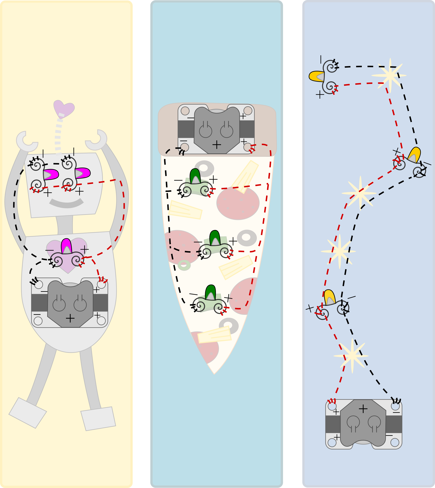
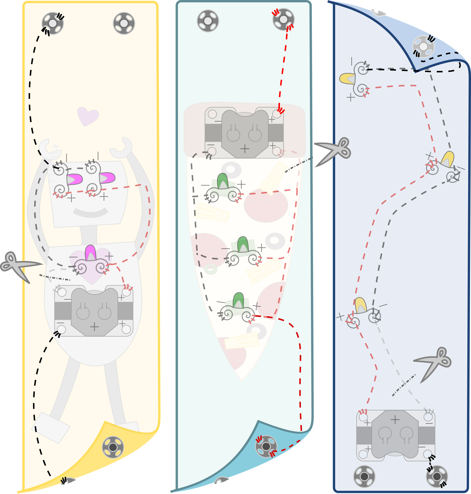

# Instructional Days: 4-7. Light-up Wristband

## Topic Description
This lesson introduces electronic sewing and stitching a wearable parallel circuit that includes a switch.

## Objectives
Students will be able to:
* Use conductive thread to sew electronic components
* Design and create a working parallel circuit with three lights
* Demonstrate how a switch works to turn electricity flow on and off
* Use an iterative design process

## Outline of the Lesson
* Journal entry (5 minutes)
* Introduce Electronic Wristband (5 minutes)
* Aesthetic Drawing (15 min)
* Introduction to electronic sewing (15 minutes)
* Sewing a simple circuit (40 minutes)
* Design Notebook (10 minutes)
* Parallel circuits (15 minutes)
* Design circuit (20 minutes)
* Electronic Wristband (30 minutes)
* Design Notebook (10 minutes)
* Adding switches (40 minutes) 
* Refine and decorate (15 minutes)
* Design Notebook (15 minutes)

## Student Activities
* Complete journal entry
* Practice basic electronic sewing
* Complete Design Notebook entry *— at end of each day*
* Design a parallel circuit
* Craft an Electronic Wristband
* Revise design to include a switch
* Refine and decorate wristband

## Teaching/Learning Strategies
### Journal Entry (5 min)
Thinking back to the Electronic Card, what were the important components of a circuit? 
* Share with elbow partners
* You may want to show “Paper Circuit” from Figure 1 below.
* With the help of the students, construct the circuit diagram for the Electronic Card on the board (see left side of “Circuit Drawing” in Figure 1 below). This will be used as a starting place to introduce electronic sewing.

Figure 1:  [Paper Circuit to Sewn Circuit](https://drive.google.com/open?id=0Bxk0iHqkw1WFN2tnYmlvMHFkMTQ) 

### Introduce Electronic Wristband or Decorative Cuff (5 min)
* The finished project can be worn as a wristband or cuff and can also be used to decorate backpacks, chairs, etc. Show some samples. See E-Textiles Technical Guide: Activity 3: Electronic Wristband [link to (pp. 58)]
* Explain that students will create their wristband through an iterative design process
	* First they will learn to sew a simple circuit with a single LED
	* Then they will craft a wristband with 3 LEDs
	* Finally, they will add a switch to their design
* See Electronic Wristband sample rubric

### Aesthetic Drawing (15 min)
* Invite students to draw what they would like their wristband to look like. It should have a battery holder (display) and three lights. *They do not need to work on correct circuitry yet. Simply get an idea on paper for what style their wristband can have.*
* *Optional:*Show examples of wristbands from the E-Textiles Technical Guide: Ideas & Inspiration [link to (pp. 58)]. Show your own wristband as an example.* Introduction to electronic sewing (15 min)
* Consult E-Textiles Technical Guide: Sewing Basics for Electronic Textiles [link to pp. 17])
* For each topic (thread a needle, create a starting knot, sew a running stitch, make an end knot) ask if any students know how to do it and have them demonstrate for the class. Use students’ prior knowledge, allowing for different demonstrations for how to do each task.
* *Optional:*Students can practice sewing on pieces of felt with non-conductive thread. They can remove the stitches with a seam ripper before they start their actual project.

### Sewing a simple circuit (40 min)
* Explain to students that they will do this project in stages, breaking a problem down into parts. First they will learn how to connect and sew one light. Then they will add on the other two lights. Finally they can add a switch (using snaps) so that the wristband only turns on when snapped together.
* Using the circuit diagram from their journal, introduce the corresponding components that will be used for this project (new LEDs, battery holder, thread, etc). 
* Choose which light to draw in and sew first (Ask students which light might be best to do first. Share their reasoning).
* Create a sewn circuit drawing next to the aesthetic drawing with one LED connected. They will add each component as you introduce them (see “Sewn Circuit” in Figure 1 above). Consult E-Textiles Technical Guide: Sewing Basics [link to (pp. 17)] for more information on each component below: 
	* Note, the same battery will be used in this project, but instead of using a paperclip to hold it in, the project uses a sewable battery holder
	* Explain the parts of the battery holder. *Warning*: The top metal part of the battery holder is positive. Not all of the holes need to be used for the circuit. Discourage sewing between two holes directly as that can create a short circuit on the negative side of the battery holder.
		* Add the battery holder to the sewn circuit drawing
	* The LED will be a LilyPad LED with special holes for sewing
		* Note the “+” and “–” to denote positive and negative
		* Add the LED to the sewn circuit drawing
		* Note: Figure 1 depicts a traditional LED (we use LilyLEDs)
	* Instead of copper tape, students will use conductive thread
		* Add the thread as stitches to the sewn circuit drawing
		* Red for positive, black for negative 
* Have students sew the first LED based on the sewn circuit drawing.  They will know it works if it turns on when the battery is connected. Debug as necessary.

### Design Notebook: Write down some sewing tips you would give to a beginner (10 min)
* Have students share with elbow partners
* Have a few groups share their tips with class

### Parallel circuits (15 min)
* Return to the sewn circuit design of students’ wristbands and sewn circuit drawing (see “Original” in Figure 2 below) and ask students how to add the additional 2 LEDS from their aesthetic drawing. Have students discuss how they might do this in pairs. Invite students to suggest how to make the modification to the sewn circuit diagram.
	* Add 2 LEDs below the “Original” circuit diagram from Figure 2. Ask students to share out how they might connect them. Connect them to the circuit as in “Add LEDs Outside” in Figure 2 below.
		* Emphasize the positive and negative sides of the circuit.
	* Going back to the “Original” circuit diagram, ask students if they could add LEDs *in between* the battery and the current LED. Draw your LEDs connected as in “Add LEDs Inside” from Figure 2 below.
	* Going back to the “Original” circuit diagram, ask students if it would be possible to have the positive leads of the LEDs right next to each other. Draw them as in “Add LEDs by Legs” in Figure 2 below.  Have students suggest how to connect the negative stitches.

Figure 2  [Adding Lights in Parallel](https://drive.google.com/open?id=0Bxk0iHqkw1WFdjBDay1CSTdSUFk) 

### Design Circuit (20 min)

* Have students return to their aesthetic drawing of their wristband on paper which shows the relevant decorative elements they wish to add. Have them either revise their sewn circuit diagram (“blueprint”) to include all three LEDs or draw a new sewn circuit diagram that shows how the different components connect. They may want to use tracing paper for one layer.  Designs should include the battery holder, 3 LEDs, and thread path, making sure to indicate the positive and negative polarities (which can be indicated using black or red pencils).
	* See Figure 3 below for example circuit diagrams and Figure 4 for their corresponding aesthetic drawings with circuit diagrams visible.
	* Show your example wristband as another sample.
* Have elbow partners review each other’s circuit designs.

Figure 3.  [Example circuit diagrams](https://drive.google.com/open?id=0Bxk0iHqkw1WFRndGNWQzZ2NINTg) 

Figure 4.  [Example aesthetic drawings and circuits](https://drive.google.com/open?id=0Bxk0iHqkw1WFVDExUmNLRGp1MVE) 

### Electronic Wristband (30 min)
* Have students sew two more lights onto wristbands (in parallel as discussed above).
* **Warning**: crossing opposite polarities will cause a short circuit!
* See E-Textiles Technical Guide: Activity 3: Electronic Wristband [link to (pp. 58)]
* When students are finished, have them test their wristbands with a battery. 
* Use alligator clips to debug circuits as necessary. See E-Textiles Technical Guide: Troubleshooting - Electrical Problems [link to p. 33).

### Design Notebook (10 min): Respond to one of the following prompts
* Draw/write tips for sewing LEDs in parallel.
* What are some of the important aspects of a parallel circuit?
* What are some ways a parallel circuit is different from a simple circuit?
* *Encouraged:*In addition, take a picture of your Wristband progress so far.* 

### Adding Switches (40 min)
* Currently students’ wristbands will always be on. Show students a completed Electronic Wristband and ask them how the lights are switched on and off. Ask them what might be the switch for the Wristband. The snap is the switch!
* Referring to one of the drawings from Figure 4, have a conversation about creating a switch: 
	* Draw one pair of snaps without connecting them to the circuit.
	* Explain that the snaps are conductive like the thread because they are made of metal.
	* Explain how each of the two ends of the snaps can be made to connect to positive or negative only and how snapping them together completes the circuit.
	* Invite students to edit the design on the board to incorporate the snap as a switch. See Figure 5 below.
	* Emphasize that part of their circuit ~must be cut~ to add the switch. Ask why this is so.
	* Demonstrate how the wristband snaps. Ask students what they need to keep in mind when sewing the snaps. Emphasize that one snap must be on the *back* of the wristband. This is why each of the wristbands in Figure 5 have a corner folded up to reveal the snap on the flipside (see two pictures on left).
	* An additional set of snaps can be added for more security - these have no electrical properties, they are not connected to the circuit and can be sewn with regular (non-conductive) thread.
	* See examples in the E-Textiles  [Technical Guide](https://drive.google.com/open?id=0B23ylAf7b2eARTUyRlVRblkyTDQ)  for more information [link to (pp. u58)]

Figure 5.  [Adding snaps as switches](https://drive.google.com/open?id=0Bxk0iHqkw1WFZXJkRDc1Tk0xNDQ) 
 
* Have students revise their own circuit diagrams.
* Students will then sew on snaps as switches to their Wristbands
	* Regular sewing (non-conductive) thread or fabric glue can be used to attach any other extra decorations,to secure the rest of the battery holder, or the extraneous snaps to the fabric. 
	* Debug as necessary; alligator clips may be used to troubleshoot.

### Refine & Decorate Wristband (15 min)
* Once snaps are complete, students can take time to add to the aesthetics of their wristbands. Felt shapes can be cut and placed on top of LEDs, with or without holes to show the light (small dots of glue or a few stitches with regular thread can keep these pieces on). 
* Craft glue can be used to secure the conductive thread knots by preventing fraying.
* Students can also take home Wristbands to finesse them. But they must ~bring them back for later activities!!!~

### Design Notebook (15 min): 
* Thinking about your Wristband project, what expert tips would you give someone who is just starting this project (that you wished someone had told you when you started)?
* Share with elbow partners
	* Have a few groups share their tips with class and/or write them on a board.
* *Encouraged*: Take a picture of your wristband.

## Resources:
* Materials for each student: sewing needle, cell battery, cell battery holder, 3 LilyPad LEDs, conductive thread, 2 pairs of sewable snaps, felt sheets (~12” long, ~2” wide)
* Materials for student groups/class: fabric scissors, seam rippers, alligator clips, rulers, scotch tape, craft glue, black pencil, red pencil, felt scraps (for practice sewing or decorations), embroidery thread, sewing thread, tracing paper
*  [Wristband Diagram images](https://drive.google.com/open?id=0Bxk0iHqkw1WFTV85SUEzUmxqd28)  [in Teacher Materials - Wristband]
* Electronic Wristband sample rubric
* Design Notebooks
* E-Textiles Technical Guide
	* Sewing [link to (p. 17)]
	* Troubleshooting Electrical Problems [link to(p. 33)]
	* Example of Wristbands [link to (p. 58)]

## Recommended Add-on
### Volt Ohm exercise: Or how & why to use a multimeter (30min)
Materials: Students will need a finished or partially done project, such as the wristband project. The project should have conductive thread stitching to collect data on. Students may use the same stitching and measure different lengths and parts of it. Students will also need multimeters.  The student may work individually, pairs, or groups of four. How one groups it mostly depends on how many multimeters there are. 

DC electricity (5-10 min):
* Teacher discusses properties of DC electricity. 
	* Positive and negative parts of circuit. 
	* Open and closed circuits. 
	* Electricity goes through the most direct path with the least resistance. 
	* Ohms are the measurement we use for resistance.
* Introduce volt ohm meter:  [https://www.electronics-notes.com/articles/test-methods/meters/multimeter-resistance-measurement.php](https://www.electronics-notes.com/articles/test-methods/meters/multimeter-resistance-measurement.php)  or  [https://www.fluke.com/en-us/learn/best-practices/test-tools-basics/digital-multimeters/how-to-measure-resistance](https://www.fluke.com/en-us/learn/best-practices/test-tools-basics/digital-multimeters/how-to-measure-resistance)  Depends on the type of multimeter you have and demonstrate how to use it.

### Students measure ohms and collect data to share (20 min)
*WARNING: Make sure there is no current (no power source) connected to the micro:bit, such as a battery or connected to computer via USB.*
* Students collect data: Data students should collect, organize, and compare the resistance as measured by a multimeter over:
	* Different lengths of conductive thread, 
	* conductive thread tension, 
	* stitches per inch
	* Students can organize the data as a table and should also look at what might be the causes of poor connections or intermittent connections.
* Groups share.
* Class discussion.
* Class organizes data and discusses what they have found regarding resistance of the conductive thread. Address the following questions: How does the length of the conductive thread affect the resistance?  How does the quality of the sewing such as stitches per inch and tension on thread affect the resistance?
* Journal entry: From what you learned about the class data how will that affect your design choices and execution of sewing skills?

**Note:** For rubric below, giving partial credit is encouraged if students partially meet a requirement.

| Electronic Wristband Sample Rubric                                                                                                                                                           | Points Possible | Points Earned |
|----------------------------------------------------------------------------------------------------------------------------------------------------------------------------------------------|-----------------|---------------|
| Crafting                                                                                                                                                                                     |                 |               |
| 1. Wristband has at least 3 lights sewn in parallel.                                                                                                                                         | 10              |               |
| 2.The battery holder, LEDs, and snaps are securely sewn in (stitched through at least three times).                                                                                          | 5               |               |
| 3.Stitches are evenly spaced and no wider than ¼ inch in length.                                                                                                                             | 5               |               |
| 4.Starting and ending knots are secure. No loose or loopy threads are present in the back or front of the fabric.Comments on Crafting:                                                       | 10              |               |
| Comments on Crafting:                                                                                                                                                                        |                 |               |
| Circuitry                                                                                                                                                                                    |                 |               |
| 5.Circuit design blueprint with accurate markings: positive and negative lines, positive and negative sides of the LED, switch, all components are labelled correctly.                       | 15              |               |
| 6.Project matches the circuit design.                                                                                                                                                        | 10              |               |
| 7.All LEDs light up.                                                                                                                                                                         | 5               |               |
| 8.Wristband turns on and off when it is snapped and unsnapped.                                                                                                                               | 10              |               |
| Comments on Circuitry:                                                                                                                                                                       |                 |               |
| <td colspan=3> Overall
| 9.Design Notebook entries completed.                                                                                                                                                         | 15              |               |
| 10.Aesthetics: The design appears to be purposeful and/or personal. Care has been taken in the look and feel of the project. Students can justify their design if helpful (written, verbal). | 15              |               |
| Comments on Overall Aesthetics:                                                                                                                                                              |                 |               |
| Crafting:                                                                                                                                                                                    |                 |               |
| Circuitry:                                                                                                                                                                                   |                 |               |
| Overall:                                                                                                                                                                                     |                 |               |
| Total:                                                                                                                                                                                       | /100            |               |
|                                                                                                                                                                                              |                 |               |