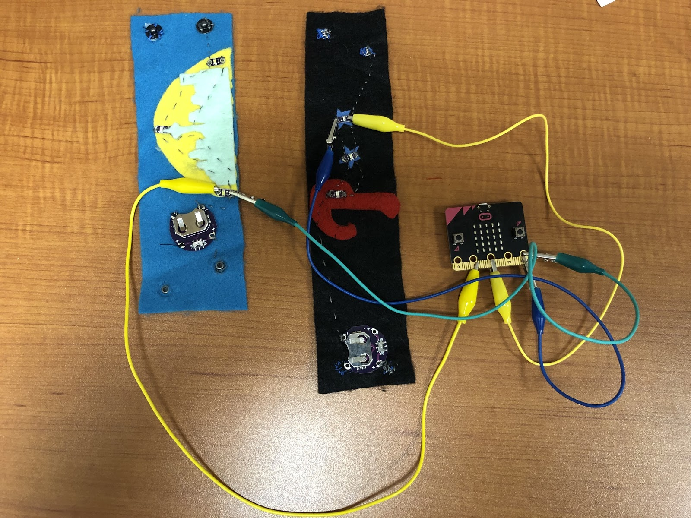

# Instructional Days: 10-11. Introduction to Programming in Python
## Topic Description
This lesson introduces students to Python programming using micro:bit

**NOTE: Make sure that your programming environment works on student computers before starting this lesson. Always test ahead of time to avoid losing class time.**

Table of Contents
=================

* [Topic Description](#topic-description)
* [Objectives](#objectives)
* [Outline of the Lesson](#outline-of-the-lesson)
* [Student Activities](#student-activities)
* [Teaching/Learning Strategies](#teachinglearning-strategies)
	 * [Journal Entry  (5 min)](#journal-entry--5-min)
	 * [Connect the micro:bit to the computer](#connect-the-microbit-to-the-computer)
	 * [Review layout of program (10 min)](#review-layout-of-program-10-min)
	 * [Demonstrate how to blink one wristband (15 min)](#demonstrate-how-to-blink-one-wristband-15-min)
	 * [Pairs code their own blinking patterns with two wristbands (20 min)](#pairs-code-their-own-blinking-patterns-with-two-wristbands-20-min)
	 * [Debugging Activity (20 min)](#debugging-activity-20-min)
	 * [Finish blinking patterns (20 min)](#finish-blinking-patterns-20-min)
	 * [Gallery walk of patterns (10 min)](#gallery-walk-of-patterns-10-min)
	 * [Design Notebook entry (5 min)](#design-notebook-entry-5-min)
* [Resources](#resources)

## Objectives
Students will be able to:
* Program a blinking light pattern in Python with their wristbands and a micro:bit.

## Outline of the Lesson
* Journal Entry (5 minutes)
* Connect the micro:bit to wristband (5 min)
* Program layout (10 minutes)
* Programming a blinking light (15 minutes)
* Blinking patterns (20 minutes)
* Debugging activities (20 minutes)
* Finish blinking patterns (20 minutes)
* Gallery walk (10 minutes)
* Design Notebook (5 minutes)

## Student Activities
* Complete journal entry
* Participate in micro:bit and program layout discussion
* Connect wristband to micro:bit
* Program a blinking light
* Create a light pattern
* Debug an existing program
* Exhibit their light pattern and see others during the gallery walk
* Complete a Design Notebook entry

## Teaching/Learning Strategies 
### Journal Entry  (5 min)
* What were some ways we used the “wait_secs” block in Scratch?
	* It may help to display a visual of the “wait_secs” block from Scratch.
	* Share responses with elbow partner.

### Connect the micro:bit to the computer
open the development environment (i.e.  [micro:bit Python](https://python.microbit.org/) ) (students work in pairs) (5 min)
* Show students how to connect the micro:bit to a computer using a micro-USB cable
	* *Tip: Sometimes there is an error message about a “keyboard” not working. Ignore this. The computer sometimes assumes that the micro:bit is an external keyboard.*
* See E-Textiles Technical Guide: Basic Programming for Electronic Textiles [(pp. 25)]

### Review layout of program (10 min)
* Use  [TurnOnTheLights_Starter.py](TurnOnTheLights_Starter.py) 
* Naming section: “name” the components connected to the pins of the micro:bit
	* They will be using their wristbands as LEDs. Looking at the naming section, have students guess which pin to connect the wristband to.
		* Since ”wristband1 = pin0”, it should be connected to pin #0
	* Have students connect their wristbands to micro:bit (see image below)
	* Relate this to making sprites in Scratch when they made the nutrition game on day 14.
* “from microbit import *” : tells python to use the microbit package that has all the useful functions we can use for the project.
* First section: tells micro:bit what is the variable and import any additional packages needed (such as “random”)
* “while True:”: the code here executes over and over
	* Relate this to the “forever” block in Scratch where the code inside the block repeats infinitely.

* In pairs, have students compile, download, and test the  [TurnOnTheLights_Starter.py](TurnOnTheLights_Starter.py)  to see the light turn on .
* Make sure students have one wristband connected to pin1 & the other to pin2 (or alter the code for the pin number connected).

### Demonstrate how to blink one wristband (15 min)
* Show students the line of code that turns the light(s) on.
* Tell them how pin1 and pin2 come with functions or methods such as write_digital() that can be used. More functions attached to this class can be found at  [microbit Documentation webpage ](https://microbit-micropython.readthedocs.io/en/latest/pin.html#classes) 
* Ask students how they think they could program that same light to turn off
	* Have students compile and try their code.
	* When the light appears to remain on, ask students why.
		* Point out that since it is looping, the light is turning on and off so fast it appears to stay on. They might have had similar problem in Scratch if they wanted to make the light blink on and off every second, how might they do this in Scratch.
		* Relate the “wait _ secs” block to the sleep() function.
		* Explain that the sleep() function takes the number of milliseconds instead of seconds like the “wait_secs” block in Scratch so delay needs to be called with the value 1000 for a 1 second delay.
		* Try the code with 1 sleep() in between setting the light to be high and low.
		* When the blinking still is not quite right, lead students to add a sleep after the line that turns the light off.
		* See  [BasicBlink_Example.py](BasicBlink_Example.py) 

### Pairs code their own blinking patterns with two wristbands (20 min)
* Have students complete  [Lighting Pattern Storyboard](https://docs.google.com/document/d/1Y6XsWdL7JIx3-EoOrMDvBs-pz7bQFufJ_Pg749CLt7I/edit?usp=sharing)  on paper.
	* Students can alternate scribing so both students get to write.
* When students are ready to code, have driver and navigator switch and program a unique light pattern.
* Have driver and navigator switch and program a second light pattern.

### Debugging Activity (20 min)
* Assign half the pairs to do “ [Debugging Fun Blink1](https://drive.google.com/open?id=1XiKwBOeR_Buyu1HWJrR9ZIfAcm6Tp4pcJUhaopGWC9w) ,” the other half to do “ [Debugging Fun Blink2](https://drive.google.com/open?id=1l9WaxSVIrgN1CAR5yfL5JMHe8Orx-vFBW3Zmna-AkbA) ”
	* Have them all complete #1 on their assignments.
* Have students load the corresponding Arduino files [also available in Google doc]:  [debuggingFunBlink1.py](debuggingFunBlink1.py)  or  [debuggingFunBlink2.py](debuggingFunBlink2.py) 
	* Have them run the code and answer #2.
		* Alternatively, you can run the program for the students as a whole class and have them complete #2
* Have students complete their debugging assignments.
* Pairs will then join another pair that had the other debugging assignment and share their scenarios and answers.
* See  [Debugging Fun Blink1 solution](https://drive.google.com/open?id=1gRCYS96F1M0MwZtKrh8d9vS3v8a3DDfbnEKEXRJeNAk)  and  [Debugging Fun Blink2 solution](https://drive.google.com/open?id=1GluZMARhv5adURJh7DPFzaup5R806opPvPFxYbZoH1Q) 

### Finish blinking patterns (20 min)
* Students finish programming their own blinking patterns, making sure each partner has had a chance to program one.
* Extension: If pairs finish programming two wristbands quickly, provide an option to add on more LEDs to program (i.e., individual LEDs, paper circuits, or more at your discretion).

### Gallery walk of patterns (10 min)
* Have students share their lighting patterns. 
* Some ideas: 
	* Students leave their blinking wristbands on the table and walk around the class, seeing other patterns
	* Have students hold up their patterns
* Encourage some compliments: What did you like? What new ideas did you get?

### Design Notebook entry (5 min)
Write down some expert tips for programming light patterns in micro:bit Python. 

## Resources
* Materials: micro:bit, micro usb cable, computer, alligator clips, student wristbands (one per student/two per pair)
*  [TurnOnTheLights_Starter.py](TurnOnTheLights_Starter.py) 
*  [BasicBlink_Example.py](BasicBlink_Example.py) 
*  [Lighting Pattern Storyboard](https://docs.google.com/document/d/1Y6XsWdL7JIx3-EoOrMDvBs-pz7bQFufJ_Pg749CLt7I/edit?usp=sharing) 
*  [Debugging Fun Blink1](https://drive.google.com/open?id=1XiKwBOeR_Buyu1HWJrR9ZIfAcm6Tp4pcJUhaopGWC9w)  
*  [Debugging Fun Blink2](https://drive.google.com/open?id=1l9WaxSVIrgN1CAR5yfL5JMHe8Orx-vFBW3Zmna-AkbA) 
*  [debuggingFunBlink1.py](debuggingFunBlink1.py) 
*  [debuggingFunBlink2.py](debuggingFunBlink2.py) 
*  [Debugging Fun Blink1 solution](https://drive.google.com/open?id=1gRCYS96F1M0MwZtKrh8d9vS3v8a3DDfbnEKEXRJeNAk) 
*  [Debugging Fun Blink2 solution](https://drive.google.com/open?id=1GluZMARhv5adURJh7DPFzaup5R806opPvPFxYbZoH1Q) 

