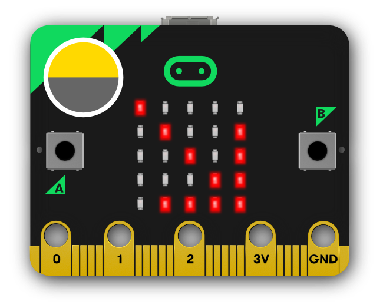

# Instructional Day:19. Programming Sensors as Inputs.

## Topic Description
This lesson introduces students to using a sensor as analog (vs digital) input.

## Objectives
Students will be able to:
* Demonstrate understanding that analog input is for a range of input values 
* Use the serial monitor to output sensor readings
* Write conditional expressions using the < and > operators

## Outline of the Lesson
* Journal entry (5 minutes)
* Digital vs. Analog activity (20 min)
* Analog inputs (15 minutes)
* Light sensor storyboard (15 minutes)
* Program conditionals (15 minutes)
* Design Notebook (5 minutes)
* Recommended (25 minutes): Explanation of Digital versus Analog

## Student Activities
* Complete journal entry
* Participate in analog inputs discussion
* Complete Light Sensor Storyboard worksheet
* Program the conditions for various light patterns
* Complete Design Notebook entry

## Teaching/Learning Strategies
### Journal Entry (5 min)
* If you had a sensor that could detect how bright the surrounding light is, what kinds of projects might you design? 
* Share with elbow partner

### Digital vs. Analogue (20 min)
* Show video then discuss as a class the difference between analogue vs. digital (4 min): FYI w/ video:  [https://www.diffen.com/difference/Analog_vs_Digital](https://www.diffen.com/difference/analog_vs_digital) 
* Have the following discussion (10 min): Think back to unit 1 when we learned how computers store and compute using binary; zeros and ones make up bits and bytes. The binary the computer uses is digital information or data. Analogue is what happens in our physical world. The computer peripherals such as the keyboard convert your analogue keystrokes into digital information. The computer converts the digital information into an analogue image on your monitor for you to read.
* Optional Journal Entry (6 min)**:**Why is it important to know what is digital and what is an analogue when you write code for a microcontroller?

### Resources
*  [https://learn.sparkfun.com/tutorials/analog-vs-digital](https://learn.sparkfun.com/tutorials/analog-vs-digital) 
*  [https://www.diffen.com/difference/Analog_vs_Digital](https://www.diffen.com/difference/analog_vs_digital) 

### Analog inputs (15 min)
* Hand out  [Light Sensor Storyboard](https://docs.google.com/document/d/1ZvjFxAPxzTpEu85ZbJpRKLhnmq4PfE1x6TbGVmTzEm4/edit?usp=sharing)  worksheet
	* In pairs, have students do #1
	* Have them locate the placement of the light sensor on the micro:bit “ By reversing the LEDs of the screen to become an input, the LED screen works as a basic light sensor, allowing you to detect ambient light.”

* Demo the micro:bit running the program  [Light_Sensor_Solution.py](Light_Sensor_Solution.py)  [up front by the teacher]
	* Connect the micro:bit 
	* Move a flashlight (or the light on your phone) closer to the light sensor. Do the same thing with your hand to block light.
	* Ask the students to describe how they think the behavior of the micro:bit is influenced by the light and your hand.
		* Guide them to discover that the brighter the light reaching the light sensor, the more lights turn on.
* Show how to display the serial monitor
	* Follow the direction in  [https://microbit-micropython.readthedocs.io/en/latest/devguide/repl.html](https://microbit-micropython.readthedocs.io/en/latest/devguide/repl.html)  to understand how to set up the serial monitor on your computer.
	* Point out how the code “prints” to the serial monitor.
	* Redo light sensor flashlight/hand demo while displaying the serial monitor so students can see how the values change.
	* Have students guess what the highest and lowest possible brightness levels are.
	* Have students guess how the number of lit lights on the micro:bit is determined based on the brightness.
		* Guide them to identify ranges of values for each number of LEDs that light up on the micro:bit.

### Storyboard (15 min)
* In pairs, have students load  [Light_Sensor_Starter code](Light_Sensor_Starter.py) 
* Pairs will complete  [Light Sensor Storyboard.pdf](https://drive.google.com/open?id=0Bxk0iHqkw1WFWDB3Q0hsalhnS0U) 
* 
### Program conditionals (15 min)
* Have students complete the Activity Section of their program and test it.
	* Students’ solutions may vary from the  [sample solution](https://drive.google.com/open?id=1g_1rWQhKe_RPU_0axBkzsdbtjCvhPLOm)  due to the brightness of classroom, etc.
* Extensions: 
	* Students could add more conditions based on the brightness level. Currently, the lights turn on the corresponding brightness.  They could create conditions so that the LED display light up different LEDs. 
	* Students can program the micro:bit to play different sounds based on the light sensor input. 

### Design Notebook (5 min)
What are some pro tips you would like to remember about using the micro:bit for analog input? Record some words, diagrams, etc. in your design notebook. 

## Recommended: Explanation of Digital versus Analog (25-30 minutes total)
### Digital vs. Analogue (20 min)
* Show video then discuss as class analogue vs. digital (4 min): FYI w/ video:  [https://www.diffen.com/difference/Analog_vs_Digital](https://www.diffen.com/difference/analog_vs_digital) 
* Have the following discussion (10 min): Think back to unit 1 when we learned how computers store and compute using binary, zeros and ones making up bits and bytes. The binary the computer uses is digital information or data. Analogue is what happens in our physical world. The computer peripherals such as the keyboard convert your analogue keystrokes into digital information. The computer converts the digital information into an analogue image on your monitor for you to read.

###  Journal Entry(6 min)
* Why is it important to know what is digital and what is an analogue when you write code for a microcontroller?
	* Resources: 
	*  [https://learn.sparkfun.com/tutorials/analog-vs-digital](https://learn.sparkfun.com/tutorials/analog-vs-digital) 
	*  [https://www.diffen.com/difference/Analog_vs_Digital](https://www.diffen.com/difference/analog_vs_digital) 

## Resources
* Materials: micro:bit, micro usb cable, computer, flashlight/cell phone light
*  [Light Sensor Storyboard.pdf](https://drive.google.com/open?id=1ZvjFxAPxzTpEu85ZbJpRKLhnmq4PfE1x6TbGVmTzEm4) 
*  [Light_Sensor_Starter code](Light_Sensor_Starter.py) 
*  [Light_Sensor_Solution code](Light_Sensor_Solution.py) 

